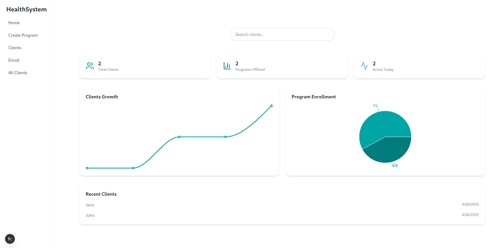

# Health System Platform

This is a **Health System Platform** built with [Next.js](https://nextjs.org), designed to allow users to create and manage health programs. The platform provides a simple and intuitive interface for creating programs with a name and description.

## Features

- Create health programs with a name and description.
- Responsive and user-friendly UI.
- Built with modern web technologies like React, Next.js, and Tailwind CSS.
- API integration for program creation.
- Ready for deployment on platforms like Vercel.

---

## Table of Contents

1. [Getting Started](#getting-started)
2. [Folder Structure](#folder-structure)
3. [Development](#development)
4. [Deployment](#deployment)
5. [API Endpoints](#api-endpoints)
6. [Technologies Used](#technologies-used)
7. [Screenshots](#screenshots)

---

## Getting Started

### Prerequisites

Ensure you have the following installed:

- [Node.js](https://nodejs.org) (v16 or higher recommended)
- [npm](https://www.npmjs.com/) or [yarn](https://yarnpkg.com/)
- [Git](https://git-scm.com/)

### Installation

1. Clone the repository:

   ```bash
   git clone https://github.com/ndalo-ben/health-system.git
   cd health-system
   ```

2. Install dependencies:

   ```bash
   npm install
   # or
   yarn install
   ```

3. Set up environment variables:

   Create a `.env.local` file in the root directory and add the following:

   ```env
   NEXT_PUBLIC_SUPABASE_URL=<your-supabase-url>
   NEXT_PUBLIC_SUPABASE_ANON_KEY=<your-supabase-anon-key>
   ```

   Replace `<your-supabase-url>` and `<your-supabase-anon-key>` with your Supabase credentials.

---

## Folder Structure

```plaintext
.
├── app/                     # Application pages and components
│   ├── create-program/      # Create Program page
│   ├── components/          # Shared components
│   ├── layout.tsx           # Root layout
│   ├── page.tsx             # Home page
├── lib/                     # Utility libraries
│   └── supabase.ts          # Supabase client setup
├── public/                  # Static assets
├── .next/                   # Next.js build output
├── package.json             # Project metadata and scripts
├── README.md                # Documentation
└── tsconfig.json            # TypeScript configuration
```

---

## Development

### Running the Development Server

To start the development server, run:

```bash
npm run dev
# or
yarn dev
```

Open [http://localhost:3000](http://localhost:3000) in your browser to view the app.

### Editing the Code

You can start editing the app by modifying files in the `app/` directory. The app will automatically reload when you save changes.

---

## Deployment

### Deploying on Vercel

The easiest way to deploy your Next.js app is to use [Vercel](https://vercel.com/):

1. Push your code to a GitHub repository.
2. Go to [Vercel](https://vercel.com/) and import your repository.
3. Set up the environment variables in the Vercel dashboard.
4. Deploy your app.

For more details, check out the [Next.js deployment documentation](https://nextjs.org/docs/app/building-your-application/deploying).

---

## API Endpoints

### POST `/api/programs`

**Description:** Creates a new health program.

**Request Body:**

```json
{
  "name": "Program Name",
  "description": "Program Description"
}
```

**Response:**

- **200 OK**: Program created successfully.
- **400 Bad Request**: Validation error or missing fields.

---

## Technologies Used

- **Next.js**: React framework for server-side rendering and static site generation.
- **React**: JavaScript library for building user interfaces.
- **Tailwind CSS**: Utility-first CSS framework for styling.
- **Supabase**: Backend-as-a-service for database and authentication.
- **TypeScript**: Typed JavaScript for better developer experience.

---

## Screenshots

### Main Page




---

## Contributing

Contributions are welcome! Please follow these steps:

1. Fork the repository.
2. Create a new branch for your feature or bug fix.
3. Commit your changes and push the branch.
4. Open a pull request.

---

## License

This project is licensed under the MIT License. See the [LICENSE](LICENSE) file for details.

---

## Acknowledgments

- [Next.js Documentation](https://nextjs.org/docs)
- [Tailwind CSS Documentation](https://tailwindcss.com/docs)
- [Supabase Documentation](https://supabase.com/docs)