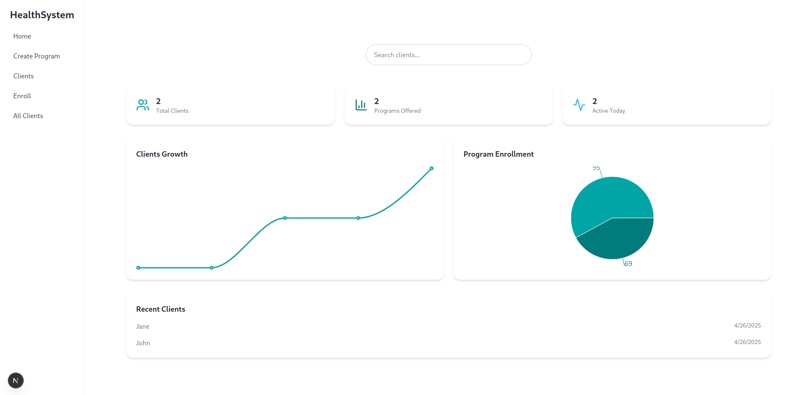
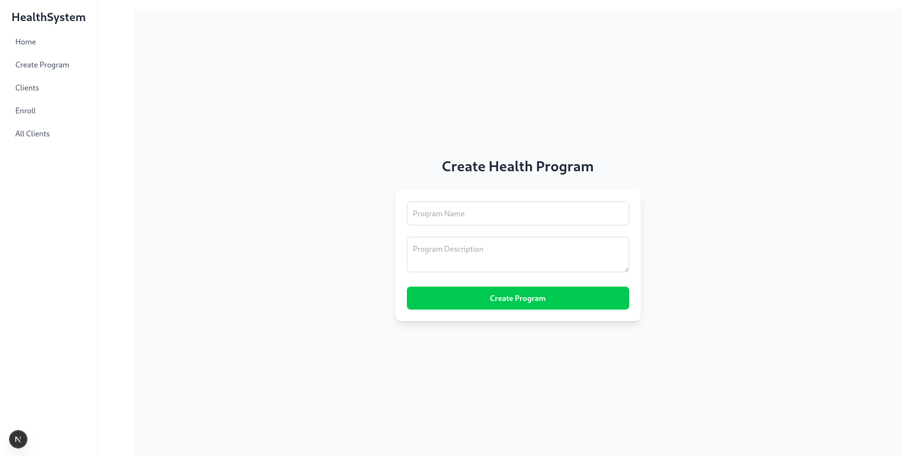
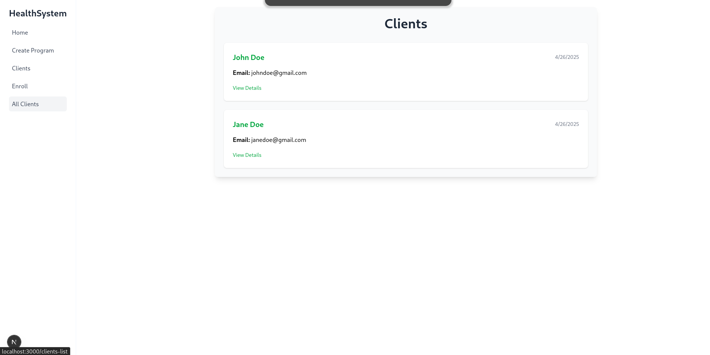
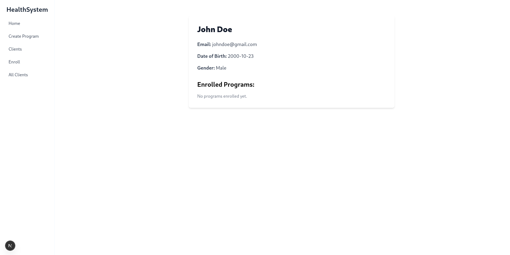

# Health System Platform

This project is a **Health System Platform** built with [Next.js](https://nextjs.org), [React](https://react.dev/), [Supabase](https://supabase.com/), and [Tailwind CSS](https://tailwindcss.com/).

It allows users to:

- **Create health programs** by providing a program name and description.
- **Manage client profiles**.
- **Enroll clients into health programs**.
- **View client profiles and their program enrollments**.

The platform uses Supabase for the backend and provides a clean, responsive, and modern interface for managing health programs and client records.

---

## Table of Contents

- [Tech Stack](#tech-stack)
- [Features](#features)
- [Screenshots](#screenshots)
- [Getting Started](#getting-started)
- [Folder Structure](#folder-structure)
- [Running the Project Locally](#running-the-project-locally)
- [Deployment](#deployment)
- [API Endpoints](#api-endpoints)
- [User Guide](#user-guide)
- [License](#license)

---

## Tech Stack

- [Next.js 14 (App Router)](https://nextjs.org/)
- [React 18](https://react.dev/)
- [Supabase](https://supabase.com/) (PostgreSQL database, API)
- [Tailwind CSS](https://tailwindcss.com/) (styling)
- [TypeScript](https://www.typescriptlang.org/)

---

## Features

- Create a new health program by providing a **program name** and **description**.
- View all **created health programs**.
- Create new **client profiles** (first name, last name, email).
- Enroll **clients into programs** with start and end dates.
- View individual **client profiles**, including programs they are enrolled in.
- Responsive design for desktop and mobile screens.

---

## Screenshots

|                 Home Page                 |                      Create Program                      |                     Clients List                     |                      Client Profile                      |
| :---------------------------------------: | :------------------------------------------------------: | :--------------------------------------------------: | :------------------------------------------------------: |
|  |  |  |  |

---

## Getting Started

### Prerequisites

- [Node.js](https://nodejs.org/en) (v16+)
- [npm](https://www.npmjs.com/) or [yarn](https://yarnpkg.com/)
- [Supabase account](https://supabase.com/)

### Installation

1. Clone the repository:

```bash
git clone https://github.com/ndalo-ben/health-system-platform.git
cd health-system-platform
```

2. Install dependencies:

```bash
npm install
# or
yarn install
```

3. Set up environment variables:

Create a `.env.local` file in the root folder and add:

```bash
NEXT_PUBLIC_SUPABASE_URL=your-supabase-url
NEXT_PUBLIC_SUPABASE_ANON_KEY=your-supabase-anon-key
```

You can get these values from your Supabase project settings.

---

## Folder Structure

```plaintext
.
├── app/
│   ├── create-program/     # Create Program page
│   ├── clients/             # Clients listing and profiles
│   ├── components/          # Reusable components
│   ├── layout.tsx           # Root layout
│   ├── page.tsx             # Home page
│   ├── globals.css          # Tailwind global styles
├── lib/
│   └── supabase.ts          # Supabase client
├── public/
│   └── screenshots/         # App screenshots
├── .env.local               # Environment variables (not committed)
├── package.json             # NPM scripts and project metadata
├── tailwind.config.ts       # Tailwind CSS configuration
├── tsconfig.json            # TypeScript configuration
└── README.md                # Project documentation
```

---

## Running the Project Locally

```bash
npm run dev
# or
yarn dev
```

Visit [http://localhost:3000](http://localhost:3000) to view the app.

---

## Deployment

The project can be easily deployed on platforms like [Vercel](https://vercel.com/).

1. Push your project to GitHub.
2. Go to [Vercel](https://vercel.com/) and create a new project.
3. Link your GitHub repository.
4. Add the environment variables on Vercel.
5. Deploy 🚀.

---

## API Endpoints

The app uses internal API routes to interact with Supabase.  
Here are the available endpoints:

---

### `POST /api/programs`

**Create a new health program.**

**Request Body:**

```json
{
  "name": "Program Name",
  "description": "Program Description"
}
```

**Responses:**

- `200 OK`: Program created successfully.
- `400 Bad Request`: Validation error.

---

### `POST /api/clients`

**Create a new client profile.**

**Request Body:**

```json
{
  "first_name": "John",
  "last_name": "Doe",
  "email": "johndoe@example.com"
}
```

**Responses:**

- `201 Created`: Client created successfully.
- `400 Bad Request`: Missing required fields.

---

### `GET /api/clients`

**Get a list of all clients.**

**Responses:**

- `200 OK`: Returns a list of clients.

Example:

```json
[
  {
    "id": "client-uuid",
    "first_name": "John",
    "last_name": "Doe"
  },
  ...
]
```

---

### `GET /api/clients/:clientId`

**Get a single client profile and their enrolled programs.**

**Request Parameters:**

- `clientId` (string): ID of the client.

**Responses:**

- `200 OK`: Returns client profile and enrolled programs.
- `404 Not Found`: Client not found.

Example:

```json
{
  "id": "client-id",
  "first_name": "John",
  "last_name": "Doe",
  "email": "john@example.com",
  "enrolled_programs": [
    {
      "program_id": "program-id",
      "program_name": "Diabetes Health Plan",
      "start_date": "2025-05-01",
      "end_date": "2025-08-01"
    }
  ]
}
```

---

## User Guide

After setting up the project locally or on production:

1. Visit the home page `/`
   - View all created health programs.
2. Click **Create New Program**
   - Fill out the name and description fields.
   - Submit to add a new health program.
3. Go to **Clients** page `/clients`
   - View existing clients.
   - Add a new client using the **Add Client** button.
4. Click on a **client** to view their profile:
   - See the client's details.
   - See programs they are currently enrolled in.
5. Enroll a client into a program:
   - Choose a program from the dropdown.
   - Select start and end dates.
   - Submit to enroll the client into the program.

The app uses **Supabase** as the backend database, and all client and program information is stored securely there.

---

## License

Distributed under the MIT License.  
See `LICENSE` for more information.

---

# Happy Building! 🚀

---
